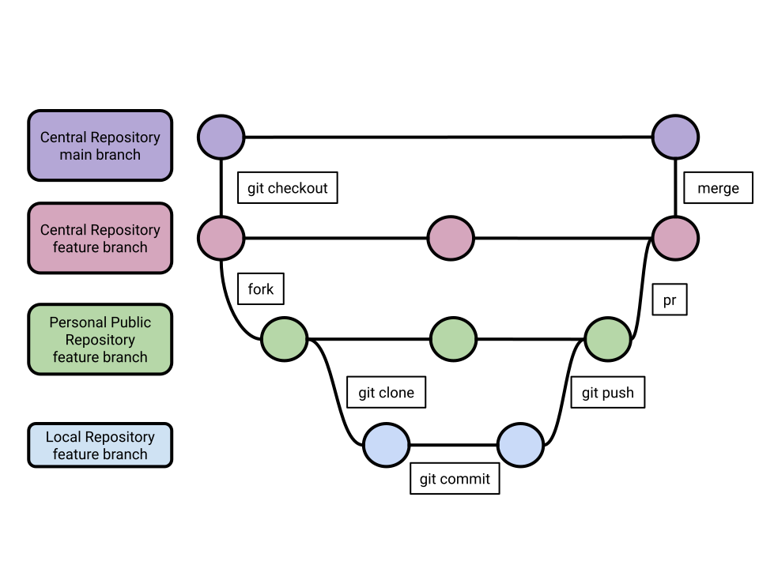

# Git Workflow Comparison

- [Git Workflow Comparison](#git-workflow-comparison)
  - [Centralized Workflow](#centralized-workflow)
    - [Steps](#steps)
    - [Use Cases](#use-cases)
    - [Issues](#issues)
  - [Feature Branch Workflow](#feature-branch-workflow)
    - [Steps](#steps-1)
    - [Use Cases](#use-cases-1)
    - [Issues](#issues-1)
  - [Forking Workflow](#forking-workflow)
    - [Steps](#steps-2)
    - [Use Cases](#use-cases-2)
    - [Issues](#issues-2)
  - [Feature Forking Workflow (Multiple-Feature Workflow)](#feature-forking-workflow-multiple-feature-workflow)
    - [Steps](#steps-3)
    - [Use Cases](#use-cases-3)
    - [Issues](#issues-3)
  - [Summary](#summary)
  - [Reference](#reference)

how to pick the right git workflow for your project

Git is a great repository tool to help developers collaborate, contribute, review, or test code. It’s the beginning of the software development life cycle. Git has lots of flexibility, therefore, there is no standard workflow which can fit all cases. Sometime, teams can be stuck with an non-optimized workflow for a long time without realizing there is a better workflow out there. This article goes over the preferred workflow for each scenario.

## Centralized Workflow

It is a very simple workflow. You are working directly on the main branch of the Central Repository.

### Steps

1. git clone or git fetch to pull feature to local repository
2. make change
3. git add and git commit to add change to local repository
4. git push to move change to main branch

### Use Cases

-   You are the owner of the repository
-   You have no need for code review
-   You have no need for collaboration

### Issues

-   Have to be owner or collaborator of the repository
-   No code review
-   No collaboration
-   Easy to break main branch

## Feature Branch Workflow

This workflow brings feature branch into the workflow. Developers work on a separate feature branch of the Central Repository. This allows developers to work on an isolated feature branch and also adds pull requests into the workflow. The popular Gitflow Workflow is very similar to Feature Branch Workflow by dedicating branch lines like development, hotfix, feature and release, we won’t elaborate here.

### Steps

1. git checkout -b feature create a feature branch
2. git clone or git fetch to pull feature to local repository
3. make change
4. git add and git commit to add change to local repository
5. git push to move change to feature branch
6. pull request to add change into main branch
7. remove feature branch in central repository

### Use Cases

-   You are the owner of the Repository
-   Small changes

### Issues

-   Have to be owner or collaborator of the repository
-   A single large pull request at the end can be tricky to review and merge
-   Still easy to break main branch due to tricky to review a large change

## Forking Workflow

This workflow adds a personal fork on top of Centralized Workflow. It allows developers to contribute to any public repository.

### Steps

1. fork personal repository
2. git clone or git fetch to pull main branch to local repository
3. make change
4. git add and git commit to add change to local repository
5. git push to move change to main branch
6. pull request to add change into Central Repository

### Use Cases

-   Open source projects
-   Developer can independently work on different features or fixes

### Issues

-   A single large pull request at the end can be tricky to review
-   Still easy to break main branch due to tricky to review a large change

## Feature Forking Workflow (Multiple-Feature Workflow)

This workflow combines both the Feature Branch Workflow and the Forking Workflow. Although it introduces an extra merge step into master, it solves the key issue for both workflows. By adding a feature branch in Central Repository and a feature branch in Personal Repository, pull requests can be done earlier, as small as possible and as many as possible. Make it much easier to reviewer and improve the code quality. Also there is new conflict to resolve as feature branch is usually isolated, unless you have more than a person working on the same feature branch (which is rare).
Given the feature branch in Central Repository has been reviewed and passed test in pull request, the extra merge step at the end is really a mechanical merge. No more feature related reviews. It’s very easy.

### Steps

1. git checkout -b feature create feature branch (by owner of repository)
2. fork personal repository
3. git clone or git fetch to pull feature branch to local repository
4. make change
5. git add and git commit to add change to local repository
6. git push to move change to feature branch in fork
7. pull request to add change into feature branch in Central Repository
8. once feature is completed, merge feature branch into main branch in Central Repository (by owner of the repository)
9. remove the feature branch in central repository (by owner of the repository)

### Use Cases

-   Large change for feature branch can be split into many small changes
-   Isolate work on individual feature
-   Constant collaboration using pull request

### Issues

-   Open source projects can be tricky, as owner need create feature branch first
-   Extra branches and steps
-   Could be unnecessary for small fixes

## Summary

As you can see, each workflow is good at a certain case. From our experience, we recommend **Feature Forking Workflow** for most of internal projects, as it maximizes the collaborations by making it possible to add small pull requests frequently without break main branch. For open-source projects, **Forking Workflow** is recommended. For personal project or small project, either **Feature Branch Workflow** or **Forking Workflow** can work well. **Centralized Workflow** is not recommended as it has no pull request review in the workflow and make it easy to break main branch.

## Reference

1. <https://www.atlassian.com/git/tutorials/comparing-workflows>
